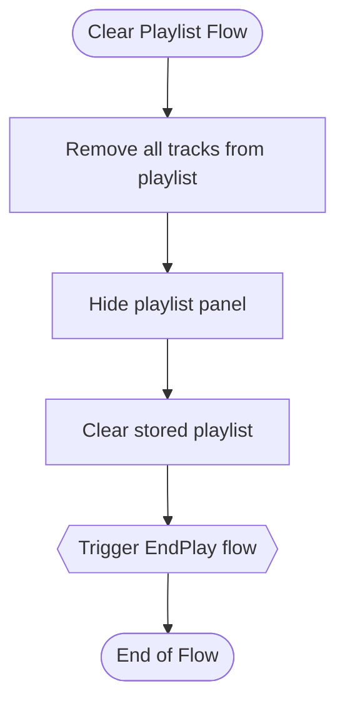

# Music.js Flow Diagrams

This document provides flowcharts for all code flows in the Music.js application. Each flowchart represents a distinct execution path, starting from an entry point such as a user interaction, initialization, or callback.

><span style="font-size: 80%;">_**NOTE**:  This document was created with the help of an AI agent by analyzing the Music.js code.  While it did a lot of manual steps, it also required many prompts and explanations to get it to produce something that was relatively consistent with the design and behavior of the code.  It surprized me first in that it had a reasonable first cut but it also surprised me as to how it got a numner of things wrong even though it got other things relatively correct._</span>

## The Continuation Model and Event-Driven Architecture

Music.js is built around a fundamental architectural principle: all code execution flows are initiated by events and run to completion. These events can come from various sources:

1. **User interactions** (clicks, drags, etc.)
2. **Scheduled continuations** (setTimeout, setInterval)
3. **Audio playback events** (ended, timeupdate, etc.)
4. **Network/Promise completions**

A key insight is that continuations (setTimeout) are just another form of event-driven trigger. Instead of breaking operations into complex nested callbacks or managing state machines, Music.js uses setTimeout to:

- Break complex operations into smaller, more manageable pieces
- Allow the UI to remain responsive during complex operations
- Maintain a clean, linear code structure
- Schedule operations to occur at the appropriate time

Each flow executes for a defined period, potentially setting up future events, and then completes. This pattern enables a clean separation of concerns while ensuring the application remains responsive and maintainable.

## Table of Contents

- [Music.js Flow Diagrams](#musicjs-flow-diagrams)
  - [The Continuation Model and Event-Driven Architecture](#the-continuation-model-and-event-driven-architecture)
  - [Table of Contents](#table-of-contents)
  - [Application Initialization Flow](#application-initialization-flow)
    - [Event Setup Flow](#event-setup-flow)
  - [Audio Playback Control Flows](#audio-playback-control-flows)
    - [Play Track Flow](#play-track-flow)
    - [Play Button Flow](#play-button-flow)
    - [Pause Track Flow](#pause-track-flow)
    - [Next Track Flow](#next-track-flow)
    - [Previous Track Flow](#previous-track-flow)
    - [Track Ended Flow](#track-ended-flow)
    - [Play Next Track Flow](#play-next-track-flow)
    - [Preload Next Track Flow](#preload-next-track-flow)
    - [Time Update Flow](#time-update-flow)
  - [Playlist Management Flows](#playlist-management-flows)
    - [Add to Playlist Flow](#add-to-playlist-flow)
    - [Remove from Playlist Flow](#remove-from-playlist-flow)
    - [Clear Playlist Flow](#clear-playlist-flow)
    - [Add All Files Flow](#add-all-files-flow)
    - [Save Playlist Flow](#save-playlist-flow)
  - [User Interface Interaction Flows](#user-interface-interaction-flows)
    - [Progress Slider Interactions](#progress-slider-interactions)
      - [Progress Slider Click Flow](#progress-slider-click-flow)
      - [Slider Knob Grab Flow](#slider-knob-grab-flow)
      - [Slider Knob Move Flow](#slider-knob-move-flow)
      - [Slider Knob Release Flow](#slider-knob-release-flow)
    - [Show/Hide Details Flow](#showhide-details-flow)
  - [Directory Navigation Flows](#directory-navigation-flows)
    - [Load Directory Flow](#load-directory-flow)
    - [LoadDirPart2 Flow](#loaddirpart2-flow)
    - [LoadedDir Flow](#loadeddir-flow)
    - [Navigate to File Directory Flow](#navigate-to-file-directory-flow)
  - [Metadata Handling Flows](#metadata-handling-flows)
    - [ID3 Tag Loading Flow](#id3-tag-loading-flow)
      - [Initial ID3 Loading Flow](#initial-id3-loading-flow)
      - [Header Response Flow](#header-response-flow)
      - [Tag Data Response Flow](#tag-data-response-flow)
      - [Relationship to DisplayTrackInfo Flow](#relationship-to-displaytrackinfo-flow)
    - [Display Track Info Flow](#display-track-info-flow)
    - [Process ID3 Tags Flow](#process-id3-tags-flow)
  - [Conclusion: The Power of Event-Driven Architecture with Continuations](#conclusion-the-power-of-event-driven-architecture-with-continuations)

## Application Initialization Flow

This flow represents the sequence of operations during application startup when the `Start()` function is called from the HTML document's onload event.

The initialization process demonstrates a key principle of Music.js: systematic state restoration and event binding that creates the foundation for all subsequent event-driven flows. Rather than initializing everything at once, the application:

1. Sets up event handlers first, establishing the pathways for user interaction
2. Restores previous state (position and playlist) to maintain continuity between sessions
3. Finally triggers the initial directory load as a separate operation

This separation ensures the application becomes interactive quickly, with more resource-intensive operations happening later.


### Event Setup Flow

This flow represents how event handlers are attached to various elements during initialization. The comprehensive event setup is critical to the application's event-driven architecture - each handler represents a potential entry point for a new flow of execution.

Note how the event setup is organized by functional areas (player controls, play/pause, progress slider, UI controls), creating a clean separation of concerns. This organization reflects the application's modular design where each set of related controls manages a specific aspect of functionality.


## Audio Playback Control Flows

This section covers the heart of the music player functionality: starting, stopping, and navigating through audio tracks. The audio playback system in Music.js demonstrates several key architectural principles:

1. **Event-driven state changes**: Audio state transitions (play, pause, end) trigger UI updates through events
2. **Continuation model**: Complex operations like loading and playing tracks are broken into steps using setTimeout
3. **Preloading strategy**: Next tracks are preloaded in the background for seamless transitions
4. **Error resilience**: Each flow includes checks and error handling to maintain stability

A critical insight is that all audio operations trigger their own event chains. For example, playing a track not only starts playback but sets up event handlers that will trigger other flows (like TimeUpdate or EndPlay) as the audio plays.

### Play Track Flow

This flow represents what happens when a user selects a track to play from the file list. The flow demonstrates how user interaction (clicking a track) initiates a sequence that may trigger other flows.


### Play Button Flow

This flow represents the simple action of the play button click. Note how it's a focused, single-purpose flow that checks for a current track and plays it if available. This exemplifies the principle of each flow having a specific purpose and not trying to do too much.


### Pause Track Flow

This flow represents what happens when the user clicks the pause button.


### Next Track Flow

This flow represents what happens when the user clicks the Next Track button or when a track finishes playing.


### Previous Track Flow

This flow represents what happens when the user clicks the Previous Track button.


### Track Ended Flow

This flow represents what happens when a track finishes playing, or when the user skips to the next track.


### Play Next Track Flow

This flow represents the process of loading and playing the next track in the playlist. It's triggered when a track ends, when the user clicks the Next Track button, or when the playlist changes.

This flow demonstrates the continuation model in action. Note how after initiating playback, a setTimeout call (`setupDelayedOperations`) defers several non-critical operations:

1. The initial track playback begins immediately
2. Then separate, delayed operations handle UI updates and preloading the next track
3. This separation ensures the audio starts as quickly as possible while deferring other operations

This pattern also provides clean error handling, as each phase can respond to failures independently.


### Preload Next Track Flow

This flow represents the process of preloading the next track in the playlist for seamless playback transitions. This is a critical optimization that demonstrates another use of the continuation model - preloading future content while the current track plays.

The preloading process happens asynchronously and doesn't block the main playback flow, but ensures that when the current track ends, the next one is ready to play instantly. This enhances the user experience by eliminating delays between tracks.


### Time Update Flow

This flow represents what happens during audio playback to update the UI, triggered by the audio element's timeupdate event. This is a prime example of how audio events drive UI updates in an event-driven architecture.

The TimeUpdate flow executes frequently during playback (typically several times per second) and performs two critical functions:
1. It updates the visual representation of playback progress
2. It persists the current playback position to storage for potential session resumption

This flow demonstrates how the application responds to events from the audio element itself, not just user interactions, creating a responsive interface that accurately reflects the current playback state.


## Playlist Management Flows

This section covers flows related to managing the playlist of tracks. The playlist system in Music.js demonstrates:

1. **Visual feedback** through staggered animations for multiple track additions
2. **State persistence** by saving playlist state between sessions
3. **Continuation model** for handling potentially slow operations
4. **User feedback loops** with clear visual indications of changes

Playlist operations are particularly well-suited to demonstrate the continuation model because they often involve visual transitions that benefit from being spread out over time.

### Add to Playlist Flow

This flow represents what happens when a track is added to the playlist. It demonstrates a clever use of the continuation model (setTimeout) to create a staggered visual effect when adding multiple tracks:

1. Rather than adding all tracks instantly, each addition is slightly delayed
2. This creates a visual "flow" of tracks into the playlist
3. The delay is proportional to how many tracks are pending (5ms × pending count)

This approach enhances the user experience by making large batch additions more visually comprehensible.


### Remove from Playlist Flow

This flow represents what happens when a user clicks on a track in the playlist to remove it.


### Clear Playlist Flow

This flow represents what happens when the user clicks the "Eject All" button.



### Add All Files Flow

This flow represents what happens when the user clicks the "Add All" button. This is a perfect example of how one flow (Add All) triggers another flow (Add to Playlist) repeatedly, creating a chain of operations that execute over time.

The iterative structure combined with the delayed execution in the Add to Playlist flow means that tracks are added one by one with visual feedback, rather than all at once. This creates a more engaging and comprehensible user experience, especially for directories with many files.


### Save Playlist Flow

This flow represents what happens when the user wants to save the current playlist.


## User Interface Interaction Flows

This section covers flows that respond to direct user interactions with the interface. The UI interaction system demonstrates:

1. **Responsive feedback** - UI elements update immediately in response to user actions
2. **Event propagation control** - Events are carefully managed to prevent unintended behaviors
3. **Cross-device support** - Interactions work across mouse and touch interfaces
4. **State tracking** - The application maintains state during complex interactions like dragging

These flows show how the application responds to user-initiated events - one of the primary entry points into the event-driven architecture.

### Progress Slider Interactions

This section covers the various user interactions with the progress slider that control audio playback position. The slider interaction is a sophisticated example of handling complex user interactions:

1. The slider responds to both mouse and touch events
2. Dragging operations span multiple events (down, move, up)
3. The application pauses playback during dragging for better UX
4. Position calculations handle boundaries and constraints
5. Document-level event handlers are added/removed as needed

This complex interaction is broken into separate flows for clarity, but they work together to create a seamless user experience.

#### Progress Slider Click Flow

This flow represents what happens when a user clicks directly on the progress slider background to seek to a specific position in the track. This is the simplest interaction - a direct click to set position.


#### Slider Knob Grab Flow

This flow represents what happens when a user starts dragging the slider knob to change the playback position. This begins a multi-stage interaction process spanning several flows. Note how playback is paused immediately to provide better control during dragging.


#### Slider Knob Move Flow

This flow represents what happens when a user is dragging the slider knob, updating the position in real-time. The complexity of position calculations and constraints demonstrates the attention to detail in providing a smooth user experience.


#### Slider Knob Release Flow

This flow represents what happens when a user releases the slider knob after dragging, resuming playback from the new position. This completes the multi-stage interaction by cleaning up event handlers and resuming playback.


### Show/Hide Details Flow

This flow represents the toggling of the details panel.

```mermaid
flowchart TD
    showDetails([Show Details Flow]) --> hideShowButton[Hide show details button]
    hideShowButton --> showHideButton[Show hide details button]
    showHideButton --> displayDetailsPanel[Show details panel]
    displayDetailsPanel --> flowEnd([End of Flow])

    hideDetails([Hide Details Flow]) --> showShowButton[Show show details button]
    showShowButton --> hideHideButton[Hide hide details button]
    hideHideButton --> hideDetailsPanel[Hide details panel]
    hideDetailsPanel --> flowEnd2([End of Flow])
```

## Directory Navigation Flows

This section covers flows related to navigating through the music directory structure. The directory navigation system is one of the clearest examples of the continuation model in action:

1. Directory loading is split into multiple phases using setTimeout
2. The UI updates immediately while data processing continues asynchronously
3. Complex path parsing and breadcrumb creation happen in a separate flow
4. The approach ensures the UI remains responsive even with large directories

This separation into distinct phases through continuations is critical for performance, especially on mobile devices where DOM operations can be costly.

### Load Directory Flow

This flow represents the process of loading and displaying a directory. It demonstrates the continuation model by using setTimeout to separate the initial UI response (clearing the current display) from the potentially slower operation of building the new directory view.

**Continuation benefits here**:
- Allows the UI to visually respond immediately to the user's navigation request
- Prevents touch events from being incorrectly registered when quickly rebuilding the UI
- Breaks the complex directory loading process into distinct phases

```mermaid
flowchart TD
    loadDir([Load Directory Flow]) --> updateURLFragment[Update URL fragment]
    updateURLFragment --> clearContents[Clear current directory contents]
    clearContents --> hideAddAllButton[Hide Add All button]
    hideAddAllButton --> clearPathItems[Clear path navigation breadcrumbs]
    clearPathItems --> setDelay[Set short delay with setTimeout]
    setDelay --> loadDirPart2{{Trigger LoadDirPart2 flow}}
    loadDirPart2 --> flowEnd([End of Flow])
```

### LoadDirPart2 Flow

This flow continues the directory loading process by processing the path segments and navigating through the directory structure data. The separation from the initial LoadDir flow is a key example of the continuation model - it allows the UI to update (clearing the old content) before the potentially complex path processing begins.

This separation is particularly important for deep directory structures or when navigating on less powerful devices, as it ensures UI responsiveness throughout the process.

```mermaid
flowchart TD
    loadDirPart2([LoadDirPart2 Flow]) --> initVariables[Initialize path variables]
    initVariables --> processPathSegments[Process path segments]
    processPathSegments --> createBreadcrumbs[Create clickable breadcrumbs]
    createBreadcrumbs --> navigateToDir[Navigate to directory in data structure]
    navigateToDir --> callLoadedDir[Call LoadedDir with directory data]
    callLoadedDir --> flowEnd2([End of Flow])
```

### LoadedDir Flow

This flow represents the final phase of directory loading, where the actual directory contents (files, folders, playlists) are rendered to the UI. This complex operation is deferred until after the path processing is complete, demonstrating the multi-stage approach to complex operations.

The function builds different sections of the UI based on what content is available, providing a consistent interface regardless of the directory contents.

```mermaid
flowchart TD
    loadedDir([LoadedDir Flow]) --> createContainerDiv[Create main container]
    createContainerDiv --> checkFiles{Has files?}
    checkFiles -->|Yes| addFilesSection[Add files section]
    checkFiles -->|No| checkFolders{Has folders?}

    addFilesSection --> showAddAllButton[Show Add All button]
    addFilesSection --> addHR[Add separator]
    addHR --> checkFolders

    checkFolders -->|Yes| addFoldersSection[Add folders section]
    checkFolders -->|No| checkPlaylists{Has playlists?}

    addFoldersSection --> checkPlaylists

    checkPlaylists -->|Yes| addPlaylistsSection[Add playlists section]
    checkPlaylists -->|No| updateAddAllVisibility[Update Add All button visibility]

    addPlaylistsSection --> updateAddAllVisibility
    updateAddAllVisibility --> appendToContainer[Add contents to main container]
    appendToContainer --> savePath[Save current path to storage]
    savePath --> flowEnd3([End of Flow])
```

### Navigate to File Directory Flow

This flow represents what happens when a user clicks on a track or album art to navigate to its directory. It demonstrates how the application can create cross-links between different views, allowing users to easily navigate from a track to its containing folder.

This flow uses TriggerLoadDir, which sets up a setTimeout to execute the LoadDir flow. This is another example of using the continuation model to break operations into clean, separate steps.

```mermaid
flowchart TD
    loadSongDir([Navigate to File Directory Flow]) --> extractDirPath[Extract directory path from track path]
    extractDirPath --> triggerLoadDir{{Trigger LoadDir flow using setTimeout}}
    triggerLoadDir --> flowEnd([End of Flow])
```

## Metadata Handling Flows

This section covers flows related to loading and displaying track metadata, including ID3 tags and cover art. The metadata handling system demonstrates:

1. **Asynchronous loading** - Metadata is loaded without blocking playback
2. **Fallback mechanisms** - Multiple sources for information with graceful degradation
3. **Caching** - Results are cached to avoid redundant processing
4. **Progressive enhancement** - The UI updates as more information becomes available

Metadata operations are particularly well-suited to the continuation model because they involve potentially slow network operations and parsing of complex data formats.

### ID3 Tag Loading Flow

The ID3 tag loading process demonstrates how one operation can trigger multiple separate flows. Instead of a single monolithic flow, the ID3 loading process consists of:

1. **Initial ID3 Loading Flow**: Validates inputs, checks cache, and sets up triggers for subsequent flows
2. **Header Response Flow**: Triggered when header data is available
3. **Tag Data Response Flow**: Triggered when tag data is available
4. **Process ID3 Tags Flow**: Triggered when tag processing is complete

Each step in this chain sets up a trigger for the next flow, allowing the system to respond to data as it becomes available without blocking other operations.

#### Initial ID3 Loading Flow

```mermaid
flowchart TD
    loadID3Tags([Initial ID3 Loading Flow]) --> checkAudioElement{Valid audio element?}
    checkAudioElement -->|No| returnEmpty[Return empty object]
    checkAudioElement -->|Yes| checkCached{Tags already cached?}

    checkCached -->|Yes| returnCached[Return cached tags]
    checkCached -->|No| fetchHeader[Fetch file header bytes 0..9]

    fetchHeader --> setupHeaderTrigger{{Trigger Header Response Flow when data arrives}}

    returnEmpty --> flowEnd1([End of Flow])
    returnCached --> flowEnd1
    setupHeaderTrigger --> flowEnd1
```

#### Header Response Flow

```mermaid
flowchart TD
    headerResponse([Header Response Flow]) --> checkResponse{Response OK?}
    checkResponse -->|No| handleError[/Log error/]
    checkResponse -->|Yes| checkID3Header{Valid ID3 header?}

    handleError --> returnEmpty2[Return empty object]
    checkID3Header -->|No| returnEmpty3[Return empty object]
    checkID3Header -->|Yes| extractVersion[Extract version and revision]

    extractVersion --> calculateSize[Calculate ID3 size]
    calculateSize --> checkReasonableSize{Size > 10?}

    checkReasonableSize -->|No| returnEmpty4[Return empty object]
    checkReasonableSize -->|Yes| fetchTagArea[Fetch tag data bytes 0..size+10]

    fetchTagArea --> setupTagDataTrigger{{Trigger Tag Data Response Flow when data arrives}}

    returnEmpty2 --> flowEnds2([End of Flow])
    returnEmpty3 --> flowEnds2
    returnEmpty4 --> flowEnds2
    setupTagDataTrigger --> flowEnds2
```

#### Tag Data Response Flow

```mermaid
flowchart TD
    tagDataResponse([Tag Data Response Flow]) --> checkTagResponse{Response OK?}
    checkTagResponse -->|No| handleTagError[/Log error/]
    checkTagResponse -->|Yes| readID3Tags[Parse ID3 tags based on version]

    handleTagError --> returnEmpty5[Return empty object]
    readID3Tags --> processFrames[Process ID3 frames]
    processFrames --> extractMetadata[Extract title, artist, album, etc.]
    extractMetadata --> processCoverArt[Process cover art if present]

    processCoverArt --> cacheResults[Cache results on audio element]
    cacheResults --> returnTags[Return tag dictionary]
    returnTags --> triggerProcessID3Tags{{Trigger Process ID3 Tags Flow}}

    returnEmpty5 --> flowEnds3([End of Flow])
    triggerProcessID3Tags --> flowEnds3([End of Flow])
```

#### Relationship to DisplayTrackInfo Flow

In the code, DisplayTrackInfo calls LoadID3Tags which triggers the start of the ID3 loading flow chain:

```mermaid
flowchart TD
    displayTrackInfo[DisplayTrackInfo Flow] --> triggerID3Loading{{Trigger Initial ID3 Loading Flow}}
    triggerID3Loading --> setupFutureProcessing[Set up Process ID3 Tags Flow to run when tags are available]
    setupFutureProcessing --> displayContinues[DisplayTrackInfo flow continues]

    %% Meanwhile, these flows happen independently:
    initialID3Flow[Initial ID3 Loading Flow runs] -.-> eventuallyCompletesWithTags[Eventually completes with tags]
    eventuallyCompletesWithTags -.-> triggerID3Processing{{Trigger Process ID3 Tags Flow}}
```

The key insights:
1. Calling an async function is itself a flow trigger
2. DisplayTrackInfo sets up a flow to process tags but doesn't wait for it
3. When PreloadNext calls LoadID3Tags, it doesn't set up any processing flow - it just triggers the loading
4. Each flow completes independently in the event-driven architecture

### Display Track Info Flow

This flow represents the process of displaying information about the current track, including updating the track title, album info, and loading cover art from either the folder structure or ID3 tags.

This flow is a prime example of progressive enhancement and multiple continuation points. The information display happens in phases, with each phase adding more detail as it becomes available:

1. First, basic track information from the filename is displayed immediately
2. Then folder structure is checked for album art using `LoadDirPart2` (a continuation)
3. Finally, ID3 tags are loaded asynchronously and applied when available

This ensures the UI is always responsive and shows the best available information at each point in time.

```mermaid
flowchart TD
    displayTrackInfo([Display Track Info Flow]) --> validateInputs{Valid inputs?}
    validateInputs -->|No| logError[/Log error/]
    validateInputs -->|Yes| displayTrackName[Display track name and show track line]

    displayTrackName --> setupGotoAlbum[Create goto_album function]
    setupGotoAlbum --> setupTrackElement[Set onclick handler for track element]
    setupTrackElement --> setupAlbumElement[Set onclick handler for album element]

    setupAlbumElement --> setupCoverArt[Setup cover art with default image]
    setupCoverArt --> hideBkCoverArt[Hide back cover art initially]
    hideBkCoverArt --> setDefaultCover[Set default cover art image]

    setDefaultCover --> tryFindFolderArt[Try to find cover art in folder structure]
    tryFindFolderArt --> loadDirPart2([LoadDirPart2 Flow - continuation])

    loadDirPart2 --> checkTrackChanged{Track changed?}
    checkTrackChanged -->|Yes| flowEnd([End of Flow])
    checkTrackChanged -->|No| checkTreePart{TreePart valid?}

    checkTreePart -->|No| logTreePartError[/Log error/]
    checkTreePart -->|Yes| checkCover{Has cover art info?}

    logTreePartError --> loadID3Tags

    checkCover -->|No| loadID3Tags
    checkCover -->|Yes| loadFrontCover[Load front cover art]

    loadFrontCover --> checkBackCover{Has back cover?}
    checkBackCover -->|Yes| loadBackCover[Load back cover art]
    checkBackCover -->|No| loadID3Tags

    loadBackCover --> loadID3Tags
    loadID3Tags --> initiateAsyncID3Loading[Start async ID3 tag loading]
    initiateAsyncID3Loading --> setupTrigger{{Trigger Process ID3 Tags Flow when tags load}}
    setupTrigger --> displayFlowEnds[DisplayTrackInfo flow continues/ends]

    logError --> flowEnd
```

### Process ID3 Tags Flow

This flow is triggered by the Promise resolution event when ID3 tags have been loaded. It executes as a separate flow from DisplayTrackInfo, demonstrating how Promise handlers create new event-triggered flows.

```mermaid
flowchart TD
    processID3Tags[Process ID3 Tags Flow] --> checkTrackChanged2{Track changed?}
    checkTrackChanged2 -->|Yes| flowEnd2([End of Flow])
    checkTrackChanged2 -->|No| checkAlbumTag{Has album tag?}

    checkAlbumTag -->|Yes| updateAlbumInfo[Update album info]
    checkAlbumTag -->|No| checkTitleTag{Has title tag?}

    updateAlbumInfo --> checkTitleTag

    checkTitleTag -->|Yes| formatTitle[Format title with track number if available]
    checkTitleTag -->|No| checkCoverData{Has cover data?}

    formatTitle --> updateTrackTitle[Update track title]
    updateTrackTitle --> updatePageTitle[Update page title with track and artist]
    updatePageTitle --> checkCoverData

    checkCoverData -->|Yes| checkNeedsCover{Needs cover art?}
    checkCoverData -->|No| flowEnd2

    checkNeedsCover -->|Yes| updateCoverArt[Update cover art from ID3 tags]
    checkNeedsCover -->|No| flowEnd2

    updateCoverArt --> flowEnd2
```

## Conclusion: The Power of Event-Driven Architecture with Continuations

The flowcharts in this document illustrate how Music.js uses an event-driven architecture with continuations to create a responsive, maintainable music player application. Here are the key insights:

1. **Event-Driven Execution Model**
   - All code execution is triggered by events (user actions, audio events, network events, etc.)
   - Each flow has a single purpose and runs to completion
   - New flows are triggered through events or scheduled continuations
   - This creates a clean separation of concerns without complex state machines

2. **Continuation Pattern Benefits**
   - Breaking complex operations into smaller chunks improves UI responsiveness
   - Separating immediate actions from deferred operations creates better user experiences
   - The linear flow of code is easier to understand and maintain than deeply nested callbacks
   - Scheduled operations (like preloading) can happen in the background

3. **Progressive Enhancement**
   - Basic functionality appears immediately (fast initial loading)
   - Additional details and enhancements load asynchronously
   - Multiple sources of information (file structure, ID3 tags) are used as they become available
   - Fallbacks ensure something useful always appears, even if some data can't be loaded

4. **Cross-Flow Connections**
   - Flows connect through events and continuations
   - One flow often triggers another (e.g., EndPlay triggers PlayNext)
   - Audio element events (timeupdate, ended) serve as triggers for UI updates
   - These connections create complex behavior from simple, focused components

This architecture allows Music.js to provide a responsive, full-featured music player that works well across devices, from powerful desktops to resource-constrained mobile devices.
