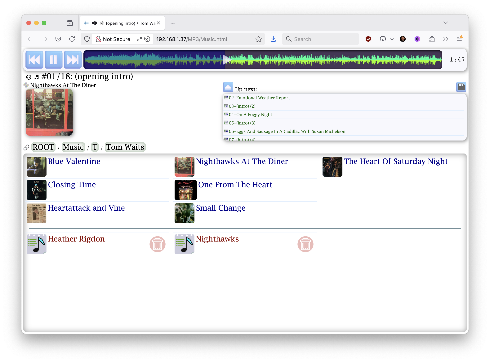
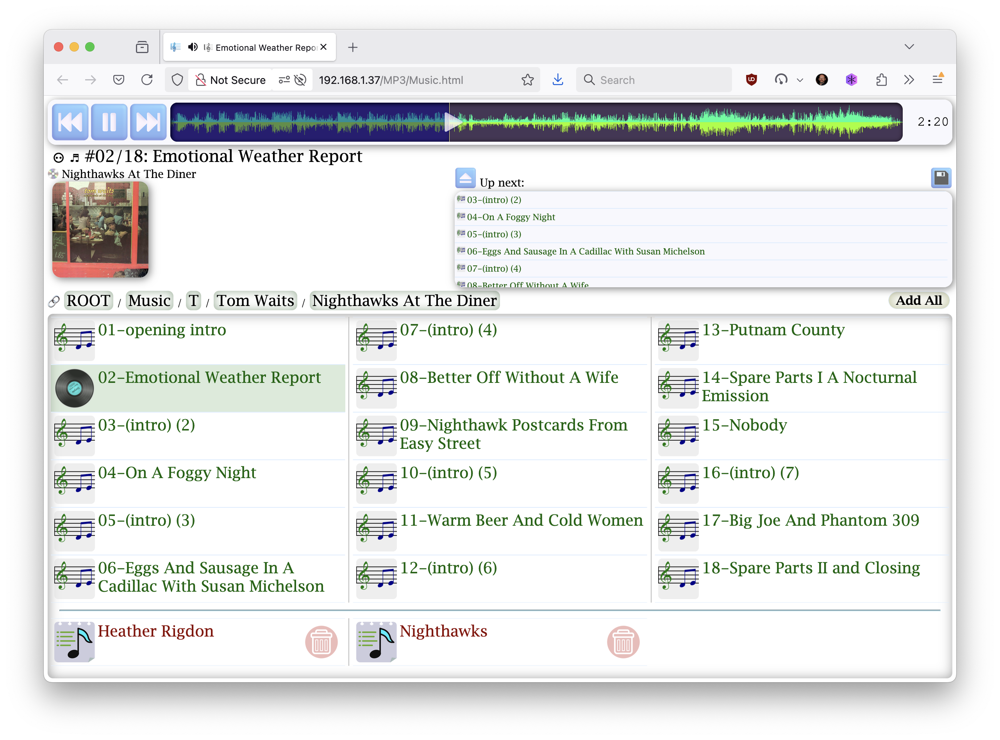
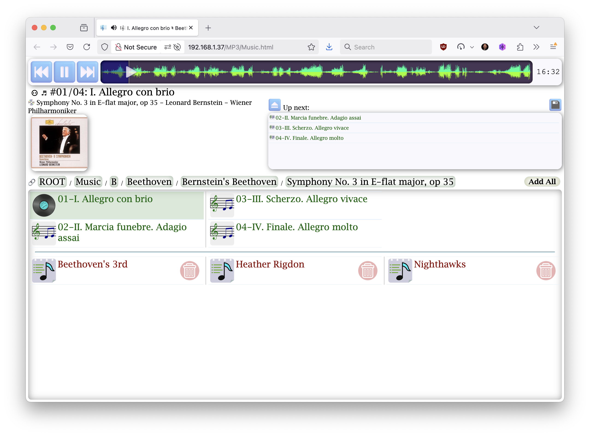
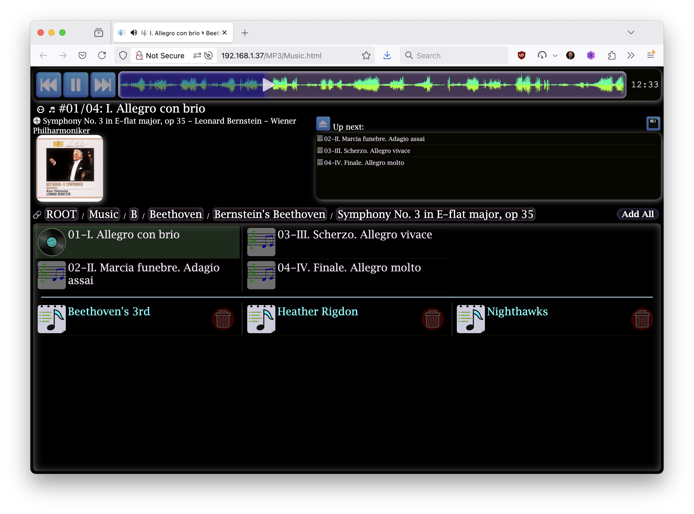
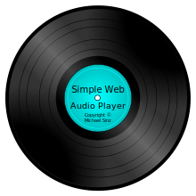
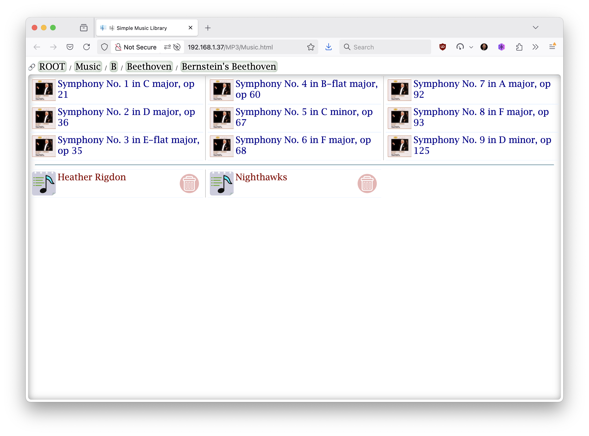
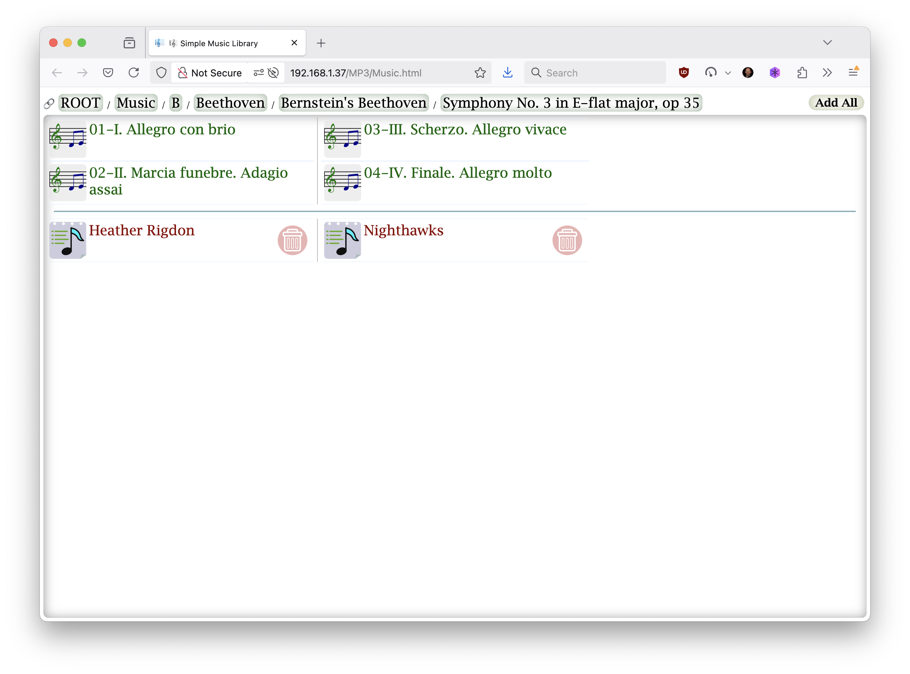
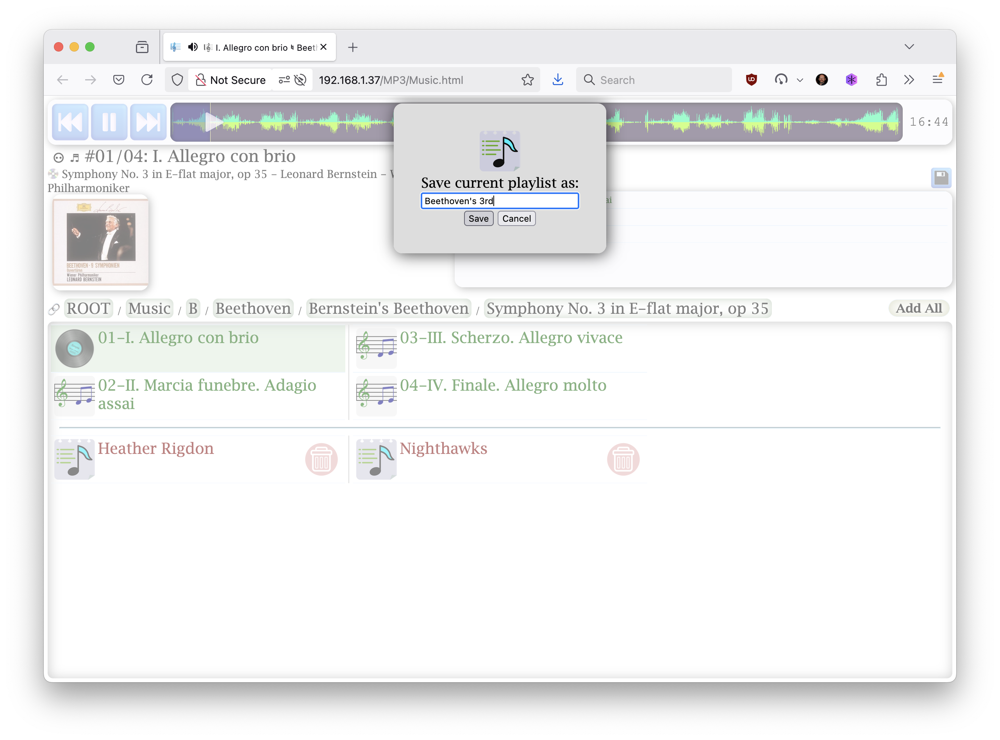

# 🎼 Simple Web Audio Player

A browser-based music player designed for personal music libraries with a focus on waveform visualization and offline playback.





## Overview

The Simple Web Audio Player began as a pet project many years ago—initially just a quick and dirty experiment that evolved to solve a specific problem: playing my personal music library exactly the way I wanted on any web-enabled device. Over the years, I've dedicated a few hours annually to refining its behavior and UI to match how I actually enjoy my digitized LP and CD collection. Finding the browser's native audio controls inconsistent across platforms, I eventually created my own custom controls, which led to the distinctive audio waveform progress bar that became an interesting feature of the player and sparked some additional technical explorations into the generation of the waveform images.

### Focus on Playback, Not Management

It's important to note that this project is deliberately focused on the playback experience, not music management.  This is not a music encoding tool, tagging system, or library organizer - it's purely about playing music in the most enjoyable way possible, with an emphasis on experiencing albums as they were intended to be heard.  I use separate specialized tools for managing, encoding, and tagging my music collection.  By maintaining this sharp focus on playback, the player remains lightweight and does exactly what it needs to do without unnecessary bloat.

All of its behaviors are client-side.  That is, there is no server side logic or data stored on the server other than the web page and the music library itself.  In fact, this can work from a local disk or USB drive nearly as well as from a web site.

As you can also see, the user interface is a bit dated based on current "standards" of flat interfaces.  But I did most of the work years ago, when flat was not the style plus, I am not so sure I like the flat, hard to identify interface elements.

### Live Demo

Experience the Simple Web Audio Player in action with our [working demo](http://sinz.com/SimpleWebAudioPlayer/Music.html) featuring Creative Commons Zero licensed music. The demo version is marked with a "Demo" label at the top and bottom of the screen, but otherwise provides the full functionality of the player.  The demo only has a few albums in it as a public demo needed to use publicly available and freely licensed music.

#### About the Music in the Demo
The demo showcases these Creative Commons Zero licensed works:

* [Open Goldberg Variations BWV 988 - Kimiko Ishizaka](https://www.kickstarter.com/projects/opengoldberg/open-goldberg-variations-setting-bach-free)
  The original project that kickstarted (pun intended) these open & Creative Commons Zero licensed recordings and sheet music.

* [Well-Tempered Clavier, Book 1 - Kimiko Ishizaka](https://welltemperedclavier.org/index.html)

* [The Art of the Fugue (Kunst der Fuge), BWV 1080 - Kimiko Ishizaka](https://kimikoishizaka.bandcamp.com/album/j-s-bach-the-art-of-the-fugue-kunst-der-fuge-bwv-1080)
  This album intentionally doesn't include a Cover.jpg file to demonstrate how the player can extract cover art from the track metadata when no album cover is provided.

## Features

- **Pure Client-Side Implementation**: Works with a simple read-only HTTP server or even directly from local disk
- **Waveform Visualization**: Visualizes audio waveforms as you play, showing louder and quieter sections
- **Offline Playback**: No internet connection required after initial load
- **Responsive Design**: Works on desktop, tablet, mobile, and in-car browsers
- **Adaptive Interface**: Larger touch targets for in-car use, keyboard/mouse controls for desktop
- **Dark/Light Mode**: Automatically adjusts for optimal visibility in different lighting conditions
- **Custom Playlists**: Create and save your own playlists
- **Album Art Support**: Displays album covers when available
- **ID3 Tag Support**: Reads and displays metadata from your files
- **Dynamic Page Title**: Updates the browser tab/window title with currently playing track and artist information, which displays on the Tesla dashboard during playback
- **Tesla-Compatible**: Tested and adjusted to work well in Tesla's browser

## The Genesis Story

This project began as a solution to a persistent problem: how to enjoy my extensive personal music library, ripped from my cherished LP and CD collection, in a way that gave me full control over the experience.

Drawing on decades of experience in media systems and computer engineering—including work on the Amiga Computer in the late 1980s and early 1990s—I approached this project with a focus on performance and user experience that commercial solutions often overlook.

My relationship with digital audio goes deep—much of my early music collection was encoded using my own custom MP3 encoder, pushing the boundaries of what was possible at the time (sometimes with interesting results that required re-ripping).  Over the years, I've transitioned to using more standard tools like ffmpeg/LAME with my own tweaks, though as these tools have matured and incorporated many of my wishlist features, my encoders have become more "out of the box" and less custom.

Commercial streaming services never quite satisfied me - they didn't have all my obscure albums and custom tracks.  They also really did not understand "album" centric music, where the artist intended the album to be listened to as a whole.  This is especially noticeable when trying to listen to operas and classical music but also true for many other works.  (ex. Tom Waits' _Nighthawks At The Diner_)  Meanwhile, standard media players lacked the specific behaviors I wanted or were so overweight in implementation, getting in the way of just playing the music.

### Evolving for Cross-Device Compatibility

The Simple Web Audio Player existed well before I owned a Tesla, but adapting it for in-car use presented a new and interesting challenge.  This adaptation process pushed me to refine the interface to work seamlessly across a spectrum of devices:

- Desktop computers with large monitors, keyboards, and mice
- Tablets and phones with touch screens and limited display sizes
- The Tesla's large but touch-only interface, which needed larger touch targets for safe use while driving

This cross-device compatibility effort ultimately improved the player for all platforms.  The responsive design now adapts to different screen sizes and input methods, and I implemented day/night mode shifting so the interface would be appropriately visible regardless of lighting conditions—particularly important for nighttime driving.

The Tesla experience became a compelling use case that drove much of the UI refinement, but these improvements benefited all users across all devices.

#### Light Mode vs Dark Mode CSS

For Dark Mode (night mode on the Tesla) I did not do much other than have a separate CSS selector for the colors and made it usable.  Since I am not using the SVGs in the display, I would have to change out the PNG files as I can't use CSS styles to adjust their colors.  As such, dark mode is not bad but it is not as good as it could be.  Plus, there is no standard for dark vs light album art.  The album art is what it is.





## The Waveform Saga

The most distinctive feature of the player is the waveform visualization in the progress bar.  This wasn't just a cosmetic choice - it serves a practical purpose, letting me see the dynamics of a track at a glance and making it easier to navigate to specific sections.

Creating those waveforms was an adventure in itself.  To date, I've implemented the waveform generator three times:

1. **Swift Implementation**: The original version, built to leverage Apple's media frameworks
2. **Rust Implementation**: The second version, which surprisingly outperformed Swift
3. **C Implementation**: The newest version, created as an experiment with AI code generation

Each implementation taught me something profound about programming languages, frameworks, and performance optimization:

### Swift and Apple Media Frameworks
The Swift implementation leveraged Apple's powerful media frameworks, which provided excellent format compatibility and simplified access to audio data.  On Intel Macs, these frameworks were well-optimized and performed admirably.  The implementation was clean and straightforward but ultimately revealed some performance limitations.

### Rust and Audio Processing Crates
The Rust implementation faced initial challenges with audio format compatibility, as the Rust ecosystem's audio processing crates don't yet match Apple's comprehensive media support.  On Intel machines, keeping up with Apple's optimized libraries would have required some "unsafe" and platform-specific code patterns and the whole point of Rust was to be clean and "safe" code.

However, the most fascinating discovery came after upgrading to Apple Silicon Macs.  To my astonishment, the Rust code was now slightly faster that the Swift code...  That is until I realized that I had not updated my Rust compiler to compile to native ARM code.  That means that the x86_64 Rust code, running via Rosetta 2 on the Apple Silicon ARM CPUs was actually running faster than the natively compiled Swift version of the code - source code that was unchanged from before.  This just shows how good the Rosetta 2 layer and the Apple Silicon CPUs are in that it ran significantly faster than on my Intel machines (including a water cooled, overclocked beast of a desktop) all while emulating the CPU. Once I rebuilt the Rust code to native ARM binaries, the performance gap became impressive.  Somehow the Apple media libraries or the Swift compiler (likely more the media libraries) were not as carefully optimized.  There are more details here and they can be seen in the [Rust vs. Swift & Intel vs Apple Silicon](http://sinz.org/rust-vs-swift.html) document that I had published elsewhere some time ago but is part of this project since it came out of this.

This demonstrated that Rust's performance is very good and may even be superior except when special hand-optimizations or CPU special instructions could be leveraged in a way that the compiler does not (yet) leverage/support.  Memory-safe code doesn't have to come with a performance penalty - a principle we were proving years ago while working on Microsoft's secret Midori project.

### C and AI Code Generation
The C implementation was primarily an experiment in AI-assisted coding.  After providing the AI with both the Swift and Rust implementations as reference, it produced something close enough that I decided to complete it myself.  This experience highlighted both the current capabilities and limitations of AI coding tools when tackling projects.  While the AI could understand the general approach, it required significant human guidance to create working, optimized code.

This experiment revealed important insights about the current state of AI coding assistants:

1. **Problem Scope Limitations**: Despite having access to working implementations in two languages, the AI struggled with what is actually a relatively straightforward task.  This suggests that even in 2023-2024, AI coding tools have definite limits to their "thought" scope.

2. **Engineering Management Required**: Successfully using AI for coding requires the same skills needed to manage junior engineers - breaking problems into well-defined components, providing clear specifications, reviewing output critically, and being prepared to intervene when the AI goes astray.

3. **Complementary Rather Than Replacement**: AI coding tools function best as assistants to experienced developers rather than autonomous agents.  They excel at routine tasks and simple implementations but require human supervision for algorithm design, optimization, and ensuring code correctness.

4. **Learning Gap**: Despite its impressive capabilities, the AI doesn't learn from previous interactions.  Each new task requires the same level of guidance as the first, unlike a human junior engineer who would build on past experiences.  It's like starting with a brand new junior engineer every time.

5. **Speed Advantage**: That said, what the AI was able to accomplish was done far faster than a junior engineer would have managed.  This speed advantage makes it a valuable tool despite its limitations.

For simpler tasks, AI coding tools can be remarkably effective, but this project operated at the boundary of current AI capabilities.  The experience reinforced that skilled engineers will remain essential for the foreseeable future, with AI serving as a productivity multiplier rather than a replacement.

### Performance of the various versions

You can find detailed performance comparisons in the [Rust vs Swift](http://sinz.org/rust-vs-swift.html) page and the [Waver Performance](http://sinz.org/waver-perf.html) which includes the C code version in the mix along with 4 different generations of MacBookPro machines (2 Intel and 2 Apple Silicon).

## Technical Implementation

The player is built with vanilla JavaScript, HTML, and CSS - no frameworks needed.  This keeps it lightweight and compatible with virtually any browser, including the Tesla browser.

### Key Technical Aspects

- **Event-Driven Architecture**: The application is built around a clean event-driven system with continuations
- **Progressive Enhancement**: Basic functionality appears immediately with enhancements loading asynchronously
- **Streaming Audio**: Music plays while metadata and waveforms load in the background
- **Efficient DOM Updates**: Minimizes reflows and repaints for smooth performance
- **Local Storage**: Saves playlists and play state between sessions
- **SVG Graphics**: All icons and interface elements are originally SVG, with PNG fallbacks for broader compatibility

The architecture reflects lessons learned from decades of experience in performance optimization across various computing platforms.  The event-driven model with continuations is particularly effective for audio applications, providing responsive user interaction while handling streaming media efficiently.

See [`Flowchart.md`](Flowchart.md) for a detailed look at the application's architecture and event flows.

### Project Components

The Simple Web Audio Player consists of these core files, each with a specific purpose:

#### Core Files

- **[`Music.html`](Music.html)**: The main HTML document that defines the player's structure.  It creates a clean, table-based layout with areas for the playback controls, track information, playlist, and file browser.  It loads the CSS and JavaScript files and sets up the initial loading screen.

- **`MusicList.js`**: A JavaScript file generated by [`Music.py`](Music.py) that contains the music library index as a JavaScript dictionary.  It's loaded before `Music.js` to provide the complete directory structure and file listing without requiring any server-side components.  This file enables the purely client-side browsing experience that's central to the player's design.

- **[`Music.js`](Music.js)**: The heart of the application containing all the JavaScript functionality.  It implements:
  - Audio playback controls and waveform visualization
  - Playlist management and persistence
  - Directory navigation and file browsing
  - ID3 tag extraction and display
  - Touch and mouse event handling
  - Dynamic page title updates that show current track/artist in browser tabs and the Tesla dashboard
  - An event-driven architecture with continuations for responsive UI

- **[`Music.css`](Music.css)**: The main stylesheet that defines the layout, animations, and structure of the player.  It handles:
  - Overall layout and responsive design
  - Player controls and waveform slider styling
  - Playlist and file browser appearance
  - Animation effects (like the rotating record during playback)
  - Touch-friendly sizing for mobile and in-car use

- **[`Music.color.css`](Music.color.css)**: A separate stylesheet focused exclusively on color schemes.  It contains two complete color palettes using CSS media queries:
  - Light mode: Used during daytime or in bright environments
  - Dark mode: Automatically activated at night or in dark environments
  - Automatic switching based on system preferences (prefers-color-scheme)

#### UI Graphics

The player uses SVG files for all interface elements, which are then converted to PNG files during the build process for better browser compatibility:

- **Player Controls**: [`PlayButton.svg`](PlayButton.svg), [`PauseButton.svg`](PauseButton.svg), [`NextTrackButton.svg`](NextTrackButton.svg), [`PrevTrackButton.svg`](PrevTrackButton.svg), [`EjectButton.svg`](EjectButton.svg), [`SaveButton.svg`](SaveButton.svg)
- **File Browser Icons**: [`Folder.svg`](Folder.svg), [`Music.svg`](Music.svg), [`Playlist.svg`](Playlist.svg), [`Record.svg`](Record.svg)
- **UI Elements**: [`Knob.svg`](Knob.svg) (the waveform slider handle), [`Delete.svg`](Delete.svg), [`Blank.svg`](Blank.svg)

The conversion to PNG files was initially motivated by inconsistent SVG rendering across browsers (including Tesla's browser), but proved to be the best approach for broad compatibility regardless of platform.  This ensures consistent appearance and behavior across all devices.

When browsing the music library, the player will automatically use album artwork if available:
- If a directory contains a `Cover.jpg` file, it will be displayed instead of the generic folder icon
- This provides a more visual browsing experience with album covers representing each folder
- The player also supports `Back.jpg` for displaying the back cover of albums when available

Here are examples of some of the SVG icons used in the player:

| Icon | Name | Description |
|------|------|-------------|
|  | PlayButton | Start playback |
|  | PauseButton | Pause playback |
|  | NextTrackButton | Skip to next track |
|  | PrevTrackButton | Return to start of track |
|  | Folder | Directory icon (replaced by Cover.jpg if available) |
|  | Music | Audio file icon |
|  | Record | Album/playing track icon |
|  | Playlist | Playlist icon |
|  | Knob | Waveform slider handle |

#### Screen Shots

Unfortunately, I did not capture the various hover effects that the CSS provides but there are a number of them.







#### External Dependencies

- **MusicList.js**: (Not included in the repository) This file is generated for your specific music library and contains the directory structure and file information.  It's referenced in the HTML but must be created separately.

#### Build and Utility Scripts

- **[`Music.py`](Music.py)**: A Python script that scans your music directory structure and generates the MusicList.js file.  This script creates the JavaScript representation of your music library that the player uses to navigate folders and files without requiring server-side code.

#### Waveform Generation Tools

The repository includes three implementations of the waveform generation tool in different languages:

- **[`rust/`](rust/)**: The currently preferred implementation, offering the best performance and file compression, with cross-platform compatibility.
- **[`swift/`](swift/)**: The original implementation that leverages Apple's media frameworks, limited to macOS.
- **[`c/`](c/)**: An experimental implementation created through AI-assisted coding.

These tools analyze audio files and generate PNG visualizations of their waveforms, which are then displayed in the progress slider during playback.

The architecture reflects lessons learned from decades of experience in performance optimization across various computing platforms.  The event-driven model with continuations is particularly effective for audio applications, providing responsive user interaction while handling streaming media efficiently.

See [`Flowchart.md`](Flowchart.md) for a detailed look at the application's architecture and event flows.

### Waveform Generation

The waveform images are pre-generated by a specialized tool that:

1. Processes audio files to extract amplitude data
2. Creates optimized 2-bit PNG images (tiny file size)
3. Maintains left/right channel separation for stereo visualization

The PNG files are then loaded alongside MP3s to visualize playback progress.

While I've implemented this tool in Swift, Rust, and C, I now exclusively use the Rust version due to its superior performance (especially on Apple Silicon Macs), code stability, significantly better file compression, and cross-platform compatibility.  The Rust implementation produces much smaller PNG files than those generated by Swift using Apple's frameworks, which is particularly important when dealing with large music libraries.  Additionally, unlike the Swift version which is limited to macOS, the Rust implementation can be compiled and run on any platform that supports Rust - including: macOS, Linux, Windows, and various other operating systems.

The implementation journey from Swift to Rust to C demonstrated a key principle: safe code doesn't need to compromise on performance.  The Rust implementation, written with clean, pure Rust without resorting to unsafe code patterns, not only provided memory safety guarantees but also delivered superior performance, especially on Apple Silicon - challenging the common assumption that performance requires unsafe code practices.  This reinforces one of Rust's core value propositions: that safety and performance can coexist.

The C implementation, created through AI-assisted coding, served as an interesting benchmark and learning experience.  Despite giving the AI access to both the Swift and Rust implementations as reference, it required significant hand-holding and manual code fixes to reach an appropriate quality & working state.  This project revealed that even relatively straightforward tasks can exceed the current capabilities of AI coding tools, and demonstrated that larger, more complex problems would need to be carefully decomposed by an experienced engineer - much like managing junior developers on a complex project.  Still, that which it was able to do was done far faster than a junior engineer would have done it.  Too bad it does not learn from this as the next experiment required just as much hand holding and similar prompting for something a junior engineer would have learned from the prior one.  It is like every time you start off with a brand new junior engineer.

## Using the Player

1. Place the player files in a directory with your MP3 files
2. Set up a simple HTTP server (or use from local disk for limited functionality)
3. Navigate to the Music.html file in your browser
4. Browse your music library, create playlists, and enjoy your music

For Tesla usage, I host the player on a personal web server, allowing me to access my entire music library through the car's browser, completely bypassing the limitations of the USB media player.

## Browser Compatibility Notes

While the player works on most modern browsers, there are some compatibility considerations:

- **Local File Access**: Some browsers block reading ID3 tags from local files for security reasons
- **SVG Compatibility**: Inconsistent SVG rendering across browsers led to the use of PNG fallbacks
- **Audio Format Support**: Browser-dependent; MP3 has the widest support

## Building the Project

The project includes a Makefile that automates building all components, including the waveform generation tools and converting SVG files to PNG format for better browser compatibility.

To build all necessary components:

```bash
make build
```

This will generate PNG images from SVG sources and build the default waveform generation tool (Waver-rust by default).

### About Waveform Generation

The waveform generator creates PNG visualizations of audio files that are displayed in the progress slider during playback. These PNG files are:
- Optimized 2-bit images with tiny file sizes
- Pre-generated to avoid browser processing overhead
- Created while maintaining left/right channel separation for stereo visualization

The project includes three implementations of the waveform generator:
- **Rust version** (recommended): Superior performance, better file compression, cross-platform compatibility
- **Swift version**: Uses Apple's media frameworks, macOS only
- **C version**: Experimental implementation created through AI-assisted coding

You can choose which implementation to use by modifying the `WAVER` variable in the Makefile:

```makefile
# The version of Waver to use for waveform generation
WAVER=Waver-rust  # Options: Waver-rust, Waver-swift, Waver-c
```

To build just the default waveform generator for manual use:

```bash
make waver
```

This will create the selected waveform tool (e.g., `Waver-rust`) in the project directory, which you can then use manually:

```bash
./Waver-rust path/to/your/music.mp3
```

After building the waveform tool, you can also use the Makefile to generate waveform PNGs for your entire music library:

```bash
# To build all waveform PNGs in your music directory
make localwaves
```

The tool will scan for all MP3 files that don't yet have a corresponding PNG file and create one for each. It works very quickly and in parallel across your CPU cores.

## Using the Makefile

The project includes a comprehensive Makefile that automates many common tasks. This makes it easier to build, test, and deploy the player along with all its assets.

### Prerequisites

Before using the Makefile, you'll need several tools installed on your system:

- **Basic Tools**:
  - `make` - The build system itself
  - `rsync` - Used for copying files during deployment
  - A modern web browser for testing

- **For SVG to PNG Conversion**:
  - Either `rsvg-convert` (from librsvg) or `resvg` - For converting SVG graphics to PNG
    - Install `resvg` with: `cargo install resvg`
    - Install `rsvg-convert` with: `brew install librsvg` (macOS) or `apt install librsvg2-bin` (Debian/Ubuntu)

- **For Waver Tools**:
  - **Rust Version** (recommended):
    - Rust and Cargo - To build the Rust implementation
  - **Swift Version** (macOS only):
    - Swift compiler - To build the Swift implementation
    - Xcode Command Line Tools
  - **C Version**:
    - C compiler (gcc or clang) - To build the C implementation

- **For Local Testing**:
  - `static-web-server` - A simple Rust-based web server for testing
    - Install with: `cargo install static-web-server`
  - `killall` command - For process management (built into most Unix-like systems)

Most of these tools can be installed via package managers like `apt`, `brew`, or `winget` depending on your operating system.

### Key Makefile Targets

- **`make art`**: Converts all SVG files to PNG format for better browser compatibility
- **`make waver`**: Builds the default waveform generation tool (currently Waver-rust)
- **`make waver-all`**: Builds all waveform generator implementations (Swift, Rust, and C)
- **`make build`**: Builds all PNG images and the default waveform tool
- **`make build-all`**: Builds all PNG images and all waveform tool implementations
- **`make clean`**: Removes all generated files and build artifacts

### Deployment and Testing Targets

The Makefile also includes targets to help with deploying to your local music library:

- **`make localbuild`**: Copies the web player files to your music directory (set in LOCALDIR variable)
- **`make localwaves`**: Generates waveform PNG files for all MP3s in your music directory
- **`make localtest`**: Starts a simple web server to test the player with your music library

### Customization

Before using the deployment targets, you should customize these variables in the Makefile:

```makefile
# This is the local directory where you have your music library
LOCALDIR=~/Music/MP3/

# The version of Waver to use for waveform generation
WAVER=Waver-rust

# Command to open your browser
OPEN_BROWSER=open
```

### Example Workflow

A typical workflow for setting up the player with your music library:

1. Edit the Makefile to set `LOCALDIR` to your music directory
2. Run `make build` to generate all needed assets
3. Run `make localbuild` to copy the player to your music directory
4. Run `make localwaves` to generate waveform PNGs for your music files
5. Run `make localtest` to start a test server and open the player in your browser

The SVG to PNG conversion process uses either `rsvg-convert` or `resvg` tools, which you'll need to install if you want to regenerate the PNG files from the SVG sources.

## Future Directions

While the player has served me well for years, there are always improvements to consider.  However, the reason I have made this public now is that a number of friends have seen my player and wanted to know more about it or even use it themselves.  Since my personal music library is on my personal server, that was not possible but making a public project is, so that is what this is all about.

Now there are some ideas that I would like to do when I have the chance:

- Better UI graphics, especially for dark mode.
- Search, client side, of course.  Still unsure what it should look like/act like
- Better mobile touch controls via "sheets" that open and close so that the main player is not so screen constrained
- Playlist import/export functionality, though challenging with the purely client-side architecture
- Maybe some additional visualizations that enhance the music experience and album playback, staying true to the focus on music rather than visual distractions

I've experimented with web-based waveform generation (like WebAssembly implementations) but found it impractical for longer tracks (20-100 minutes), as processing that much audio data in the browser leads to a poor user experience compared to pre-generated waveforms.  The current approach of pre-generating optimized PNG files remains the best solution, by far, for user interface, network activity, and complexity.

## Conclusion

The Simple Web Audio Player represents a personal journey to create the perfect music experience for my specific needs.  It's a testament to how personal projects can solve real problems while providing an opportunity to explore different programming languages and approaches.

What started as a solution to a frustrating car commute has become a daily-use tool that continues to (slowly) evolve.  Most importantly, it lets me enjoy my music collection exactly the way I want, whether I'm at my desk, on the go via my phone, or cruising down the highway in my car.

## License

This project is copyright Michael Sinz and shared under the MIT license for educational and inspirational purposes.